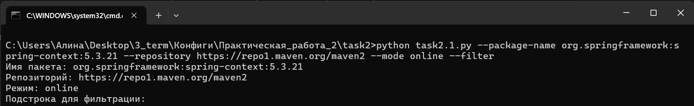
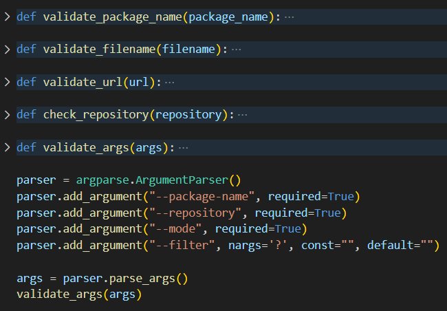
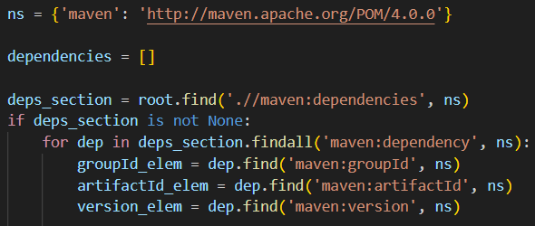
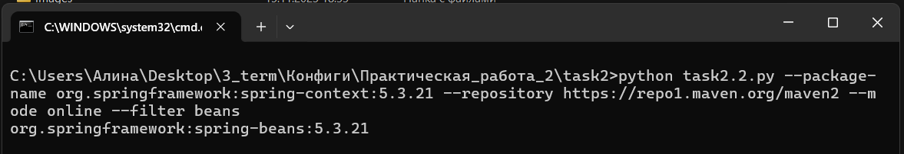

# Этап 1. Минимальный прототип с конфигурацией 

1. Источником настраиваемых пользователем параметров являются опции 
командной строки. При запуске приложения выводятся все параметры, 
настраиваемые пользователем, в формате ключ-значение. 

2. К настраиваемым параметрам относятся: – Имя анализируемого пакета. – URL-адрес репозитория или путь к файлу тестового репозитория. – Режим работы с тестовым репозиторием. – Подстрока для фильтрации пакетов. Реализована обработка ошибок для всех параметров. 

# Этап 2. Сбор данных 

1. Использовать формат пакетов Java (Maven). 

2. Извлечь информацию о прямых зависимостях заданного пользователем 
пакета, используя URL-адрес репозитория. Вывести на экран все прямые зависимости 
заданного пользователем пакета. 

